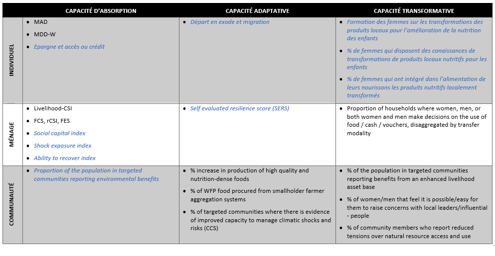

# Nouveaux indicateurs de résilience

## Logique

Le nouveau Resilience Toolkit du PAM ne prévoit pas un seul indicateur ou approche pour la mesure de la résilience au niveau corporate. Plutôt, l’approche de mesure de la résilience du PAM repose sur la logique de couvrir les différentes capacités de résilience sur lesquelles le PAM focalise ses interventions (capacités d’absorption, d’adaptation et de transformation), ainsi que les principaux niveaux d’intervention (individu, ménage et communauté) avec des indicateurs spécifiques. Le tableau ci-dessous visualise comment les indicateurs de base (en noir) et les indicateurs additionnels (en bleu) inclus dans ce guide s’inscrivent dans cette logique analytique. Pour plus de renseignements, veuillez contacter l’équipe RBD RAM (rbd.ram@wfp.org).

## Ressources pour indicateurs complémentaires

Vous trouverez ci-dessous les principales ressources pour les indicateurs additionnels inclus dans ce guide. Si vous avez des questions spécifiques sur ces indicateurs, n’hésitez pas à contacter RBD RAM (rbd.ram@wfp.org) pour plus d’informations. Veuillez aussi vous référer au Resilience Toolkit du PAM (https://resiliencetoolkit.manuals.wfp.org/en/).

**Shock Exposure Index, Ability to Recover Index & Social Capital Index (TANGO)** :
https://www.fsnnetwork.org/sites/default/files/Methodology_Guide_Nov2018508.pdf

**Asset Benefit Indicator (ABI)**: https://docs.wfp.org/api/documents/WFP-0000121064/download/

**Subjectively Evaluated Resilience Score (SERS)**: https://lindseyjonesresearchcom.files.wordpress.com/2020/09/running-the-subjectively-evaluated-resilience-score-2.pdf

Inidicateurs

Proportion of households with more than one source of income. 

Revenu agricole annuel du ménage

Proportion de ménages qui dispose d’un  membre qui est member d’un groupe d’épargne (tontine*) et ou qui fait de l’épargne sur pieds

Shock exposure index

Ability to recover index (TANGO 2018)

% d’individus ayant des connaissances sur et des capacités à mettre en œuvre de bonnes pratiques d’adaptation au changement climatique

% of households who integrate adaptation measures in their activities/livelihoods

% de ménages avec un membre ayant migré ou parti en exode à cause de difficultés alimentaires

Pourcentage de perte post-récolte

% d’individus qui ont eu une opportunité d’emploi ou un emploi plus stable grâce aux actifs créés par le programme de resilience. 

% of the population in targeted communities reporting benefits from an enhanced livelihood asset base

Nombre de mois de couverture des stocks alimentaires

Rendement agricole

% de femmes qui disposent des conaissances de transformations de produits locaux nutritifs

% de femmes qui ont intégré dans l’alimentation de leurs nourissons les produits nutritifs localement transformés. 

Production maraîchère Moyenne par ménage  

Proportion of households where women, men, or both women and men make decisions on the use of food / cash / vouchers, disaggregated by transfer modality (WFP 2020: 229)

Reduction de la charge de travail des femmes 

Proportion of women/men that feel it is possible/easy for them to raise concerns with local leaders/influential people (Suich et al. 2020: 14-15)

Proportion of male-headed households where women are involved in the decision making in relation to the use of household’s resources 

% of targeted communities where there is evidence of improved capacity to manage climatic shocks and risks (CCS) 

%  increase in production of high quality and nutrition-dense foods 

% de ménages qui ne comptent pas retirer leurs enfants de l’école pour les besoins des travaux champêtres et de l’élevage grace aux paquets intégrés (périodes de grands besoins de main d’oeuvre)

Social Capital Index (TANGO 2018)

Proportion of the population in targeted communities reporting environmental benefits

Percentage of community members who report reduced tensions over natural resource access and use (PRO-P)

Taux d’endettement des ménages/% de ménages ayant des dettes

% de groupes communautaires ayant rapporté une plus forte collaboration entre transhumants et agriculteurs residents

% de groupes communautaires ayant rapporté une plus forte collaboration entre déplacés et communauté hôtes

Proportion of households whose children benefit from school canteens 

## Questionnaire standardisé

### Version papier du questionnaire

Voici le module standardisé en format Word :
[RBDstandardized_questionnaire_resilience](https://github.com/WFP-VAM/RBD_Resilience_guide_FR/blob/main/questionnaires/RBDstandardized_questionnaire_resilience.docx?raw=true) 

### Version électronique du questionnaire

Voici le module standardisé en format xlsform :
[RBDstandardized_questionnaire_resilience](https://github.com/WFP-VAM/RBD_Resilience_guide_FR/blob/main/questionnaires/RBDstandardized_questionnaire_resilience.xlsx?raw=true) 

## Calcul d'indicateurs de résilience

### SPSS Syntax

Voici le fichier de syntaxe SPSS les syntaxes SPSS des indicateurs additionnels de résilience suivants :  

* Self evaluated resilience score (SERS) 
* Shock exposure index
* Ability to recover index 
* Social capital index (Bonding social capital index, Bridging social capital)
 
[RBDstandardized_SPSSresilience_FR](https://github.com/WFP-VAM/RBD_Resilience_guide_FR/blob/main/syntax/RBDstandardized_SPSSresilience_FR.sps) 

Pour des informations sur le calcul d'autres indicateurs de résilience  ou sur toute question concernant ces modules, contactez rbd.ram@wfp.org .
